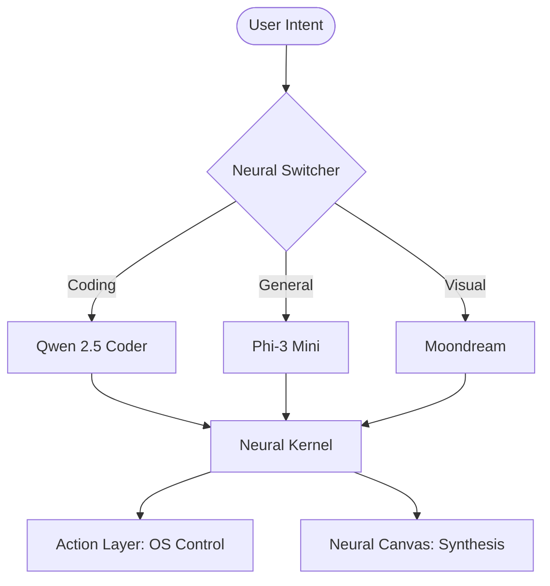

# ⚡ SYNAPSE
### **The Private Agentic Personal Assistant for High-Fidelity Workflows**

[](https://opensource.org/licenses/MIT)
[](https://www.python.org/)
[](https://ollama.com)
[](#)

Synapse is a sophisticated, privacy-first personal assistant designed for elite productivity. It leverages a **Council of Experts** architecture—a cluster of specialized Small Language Models (SLMs) orchestrated by a lightweight neural switcher—to provide coding, research, and OS-level automation directly on your machine.

---

## 🌌 Key Innovations

### 🧠 **Neural Archetypes**
Dynamic persona orchestration. Seamlessly switch between specialized cognitive profiles:
- **Software Engineer**: Precision logic and system architecture.
- **Deep Researcher**: Structured knowledge retrieval and synthesis.
- **Generalist**: Fluid daily task management and creative assistance.

### 🖼️ **Neural Canvas**
A spatial, side-by-side workspace for high-productivity synthesis. Generate, edit, and analyze in real-time within a dedicated neural layer while maintaining active link with your assistant.

### 🎯 **Council of Experts**
Zero-latency intent routing to specialized local nodes:
- **Chat Expert**: `phi3:mini` (General Logic)
- **Coding Expert**: `qwen2.5-coder:1.5b` (Engineering)
- **Vision Expert**: `moondream` (Visual Understanding)
- **Action Layer**: Native OS-level terminal and UI automation.

---

## 🏗️ Architecture



---

## 🛠️ Deployment

### Prerequisites
- **Python 3.11+**
- **[Ollama](https://ollama.com)** (Core Inference Engine)
- **Linux** (Primary Target) | macOS/Windows (WIP)

### Rapid Start
```bash
# Clone the Neural Repository
git clone https://github.com/ziuus/Synapse.git
cd Synapse

# Initialize Environment & Experts
bash install.sh

# Launch Unified Neural Link
python main.py --serve
```

---

## 📊 Technical Stack

| Layer | Technology |
|-------|------------|
| **Neural Kernel** | Python 3.11 / FastAPI |
| **Inference Engine** | Ollama (Local) |
| **Intelligence** | phi3, qwen2.5-coder, moondream |
| **Neural Dashboard** | Next.js 16 / React 19 |
| **Design System** | Antigravity Emerald Glow |
| **Motion Engine** | GSAP / Framer Motion |
| **Persistence** | SQLite (Encrypted) |

---

## ⚙️ Configuration
Customize your assistant's neural cluster in `config/models.yaml`. Define custom personas, system prompts, and expert model mappings to suit your specific workflow.

---

## 🤝 Contribution
Synapse is open-source. We welcome contributions to the neural kernel, expert plugins, and UI enhancements.

## ⚖️ License
Distributed under the MIT License. See `LICENSE` for more information.

---
<p align="center">
  Built with ❤️ for the Private Intelligence Revolution.
</p>
